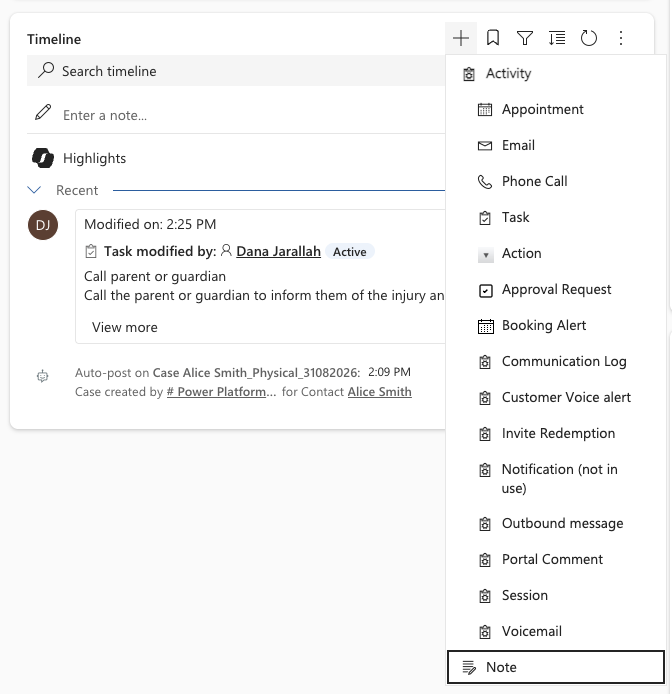
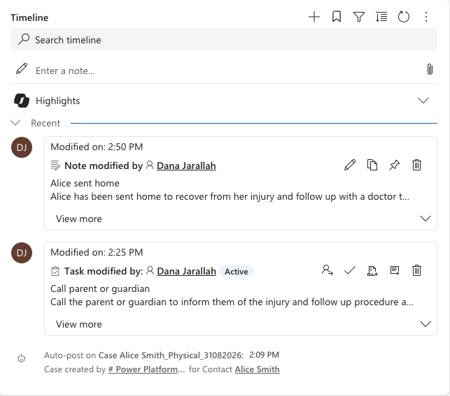

<!-- SOURCE ROW — delete before publishing
Epic:    Wellbeing (CE)
Feature: Track and manage a wellbeing note
Area:    CE
Role:    School Admin, Office Admin
-->

# Add a comment to a wellbeing case

The case timeline is the running record of what has happened. Add a comment
whenever you take an action, receive information, or hand the case on, so the
next person has the full picture.

1. Open the case timeline

   Open the wellbeing case and move to the **Timeline** tile.

2. Create the note

   Click the **+** button on the timeline and choose **Note**.

   

3. Write and save

   Type your comment and save it. The note is added to the timeline
   immediately, stamped with your name and the date.

   

   > **Note:** Most roles can't delete timeline entries. Write comments
   > as you would want them read back — they form part of the case record.
