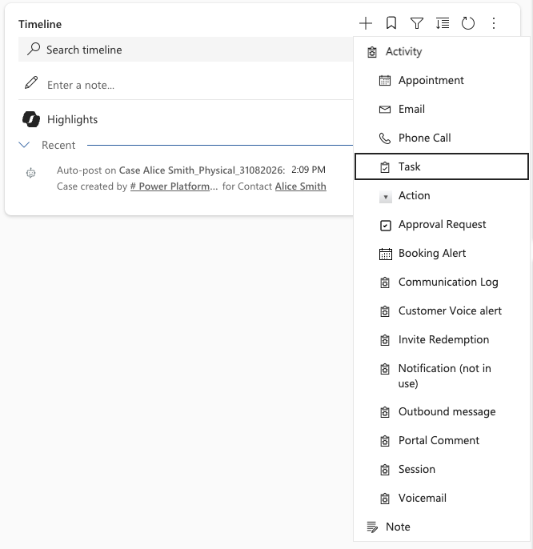
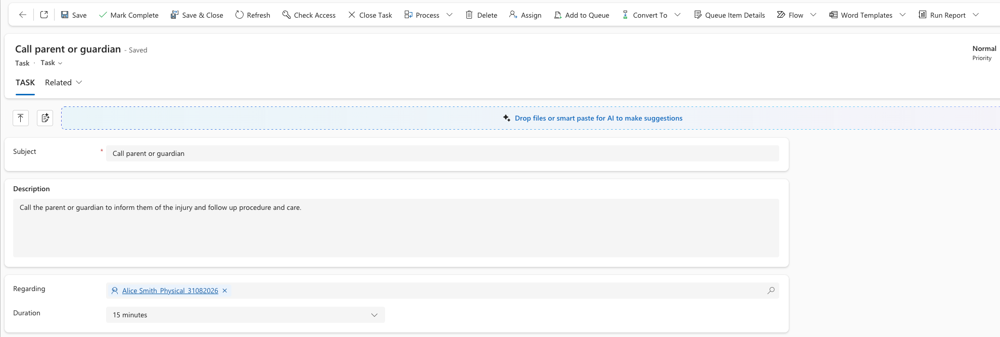
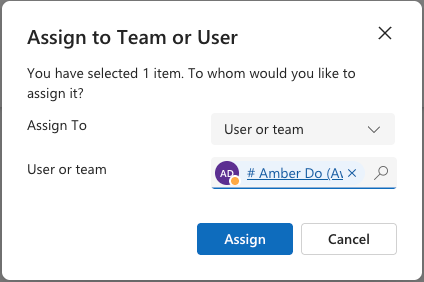
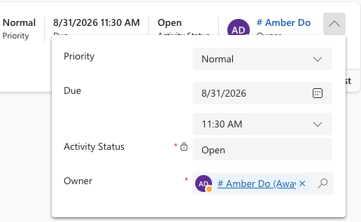

<!-- SOURCE ROW — delete before publishing
Epic:    Wellbeing (CE)
Feature: Track and manage a wellbeing note
Area:    CE
Role:    School Admin, Office Admin
-->

# Add a wellbeing case task

Tasks assign and track follow-up work on a case. Create one for
each action that needs doing — a phone call home, a counsellor check-in, a
referral.

1. Open the case activities

   From the wellbeing note, open the linked **wellbeing case**, then go to
   **Activities** and select **Task**.

   

2. Describe the task

   Give the task a **Subject** and a description. The **Regarding** field is set
   to the wellbeing case automatically — leave it as it is so the task stays
   attached to the case.

   

3. Assign it

   Set the staff member who will complete this task. There are two ways to do this: you can either click the **Assign** button in the toolbar, or you can click the down arrowhead in the top-right of the screen. Here, you can also assign the task **Priority** and **Due** date.

   > **Note:** Assigning the task to someone else does not move the case itself.
   > To hand over the whole case, change the case **Owner**.

   

   

5. Save

   Click **Save & Close**. The task appears against the case and on the assigned
   person's task list. Tasks created in the Staff Experience Platform appear
   here in exactly the same way.
