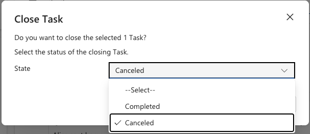

<!-- SOURCE ROW — delete before publishing
Epic:    Wellbeing (CE)
Feature: Track and manage a wellbeing note
Area:    CE
Role:    School Admin, Office Admin
-->

<!-- TODO — THIN SOURCE, UPDATE WHEN MORE INFORMATION IS AVAILABLE
Written from: Wellbeing SXP WS003, where the presenter states a task
"can complete, cancel it" while looking at the task record.
Gap: cancelling is never actually performed in any recording. We have not seen
the confirmation dialog, the resulting status value, or whether a reason is
required.
Needs: a short recording of a task being cancelled in CE.
-->

# Cancel a wellbeing task

Cancel a task when the action is no longer needed — for example the concern was
resolved another way, or the task was raised in error. Cancelling keeps the task
on the record rather than deleting it, so the history stays intact.

1. Open the task

   Open the wellbeing case, go to **Activities** and open the task.

2. Cancel it

   Choose **Cancel** instead of Mark Complete.

   

3. Check the result

   The task closes as cancelled and remains visible against the case.

   > **Note:** Cancelling is not the same as completing. Use Cancel only when
   > the work was not done — otherwise use
   > [Close a wellbeing task](./close-a-wellbeing-task.md).
