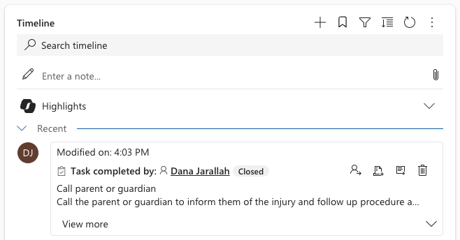

<!-- SOURCE ROW — delete before publishing
Epic:    Wellbeing (CE)
Feature: Track and manage a wellbeing note
Area:    CE
Role:    School Admin, Office Admin
-->

# Close a wellbeing task

Close a task once the action is done. The case stays open until you resolve it
separately — closing tasks and resolving the case are two different steps.

1. Open the task

   Open the wellbeing case, go to **Activities** and open the task. You can also
   reach it from your own task list.

2. Check ownership

   Confirm you are the **Owner**. If the task sits with someone else, assign it
   to yourself first, then save.

3. Mark it complete

   Click **Mark Complete**. The status changes to **Closed** and the completion
   is recorded against your name.

   

   > **Note:** Completing a task in CE also updates it in the Staff Experience
   > Platform, and the reverse is true — a task completed in SXP shows as closed
   > here.
