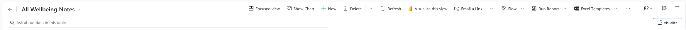
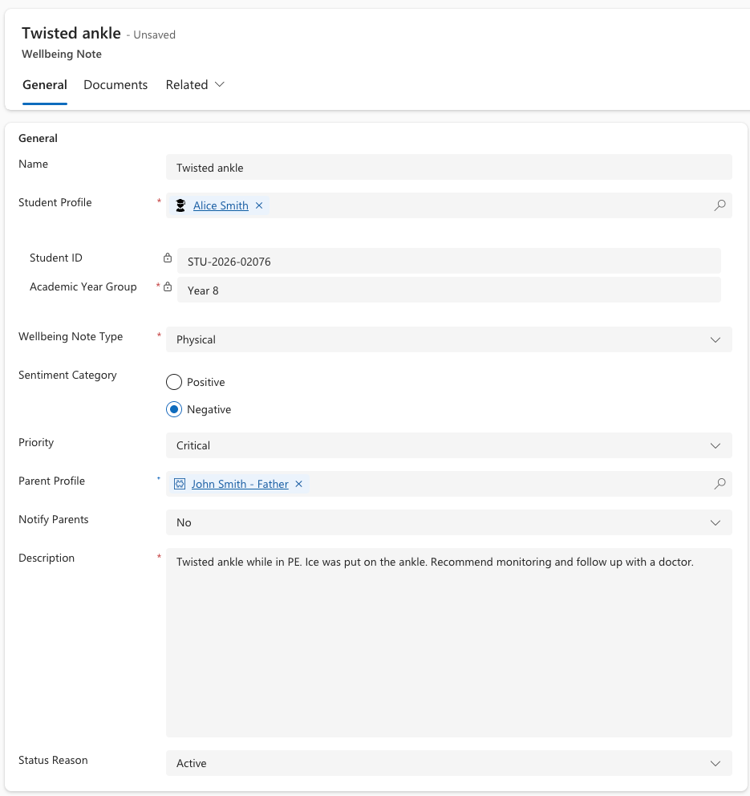
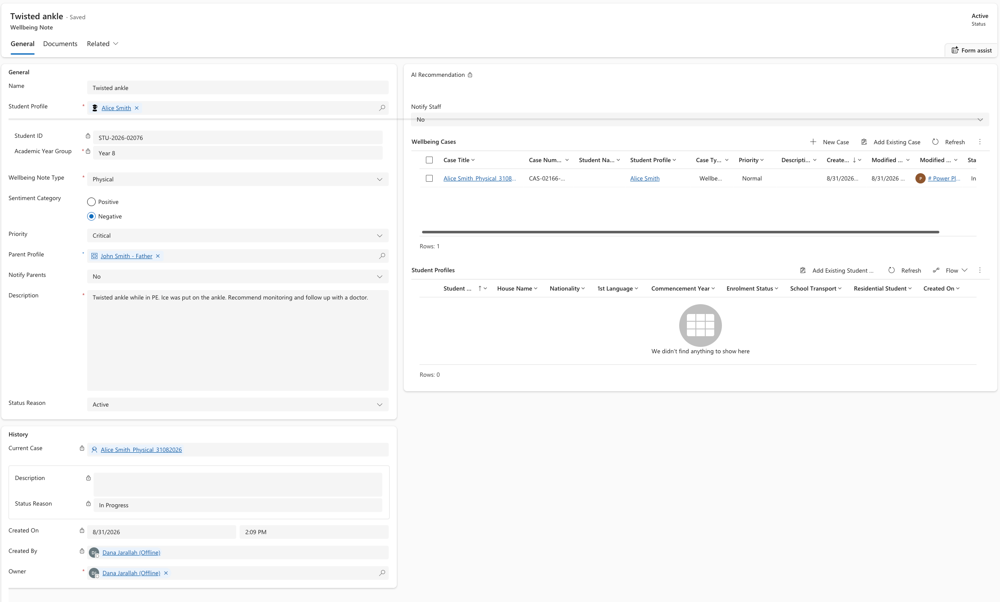

<!-- SOURCE ROW — delete before publishing
Epic:    Wellbeing (CE)
Feature: Create and Share a Wellbeing note
Area:    CE
Role:    School Admin, Office Admin
-->

<!-- TODO — THIN SOURCE, UPDATE WHEN MORE INFORMATION IS AVAILABLE
Written from: Events, Excursions & Wellbeing (20 Apr) 29:29-31:14, plus
Modules Recordings (14 Jul) for the CE-side record.
Gap: the 'share' action is never demonstrated separately in any recording, and
the exact CE navigation path to Wellbeing notes is not shown on screen.
Needs: confirmation of the navigation path (app + area) and what 'share' means
as a distinct action from Notify staff.
-->

# Create a wellbeing note and share

A wellbeing note records a concern, an observation or a positive note about a
student. Saving the note automatically opens a linked **wellbeing case**, which
is where the follow-up work is tracked.

Most teaching staff raise wellbeing notes from the Staff Experience Platform.
You create one here in CE when you do not have SXP access — for example a
receptionist or an admin officer who witnessed something themselves — or when
you are working a case from the back end.

1. Open a new wellbeing note

   In the **Wellbeing** area, open **Wellbeing notes** and click **New**.

   

2. Choose the student

   In **Student profile**, search for and select the student. Their academic
   details are pulled through from the student profile.

   > **Note:** The **Year group** only appears if it is populated on the student
   > profile. If it is blank, check the student profile first.

3. Describe the concern

   Enter a **Name** for the note, then set the **Wellbeing note type**
   (for example Physical, Mental, Social, Emotional or Academic), the
   **Sentiment** (Positive, Neutral or Negative) and the **Priority**.
   Write the **Description** — this is the detail other staff will read.

   

4. Decide who gets told

   Set **Notify parents** to Yes or No. If Yes, select the **Parent profile**
   to inform. Set **Notify staff** to Yes and add the staff members who need to
   know in the staff subgrid.

   > **Note:** Notifications to staff and parents are delivered by the
   > experience platforms, not by CE. CE stores who should be told.

5. Save

   Click **Save**. A **wellbeing case** is created automatically against the
   note and appears in the related records. Work the case from there — see
   [Track and resolve a wellbeing note](./track-and-resolve-a-wellbeing-note.md).

   
