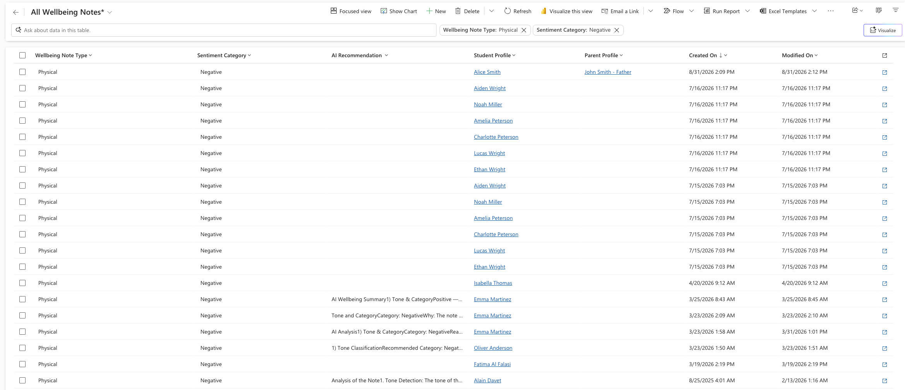
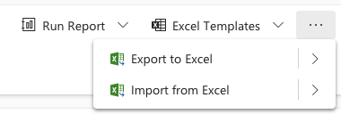

<!-- SOURCE ROW — delete before publishing
Epic:    Wellbeing (CE)
Feature: Track and manage a wellbeing note
Area:    CE
Role:    School Admin, Office Admin
-->

# Export wellbeing notes to Excel

Exporting produces a workbook containing exactly the records currently shown by
your filter — useful for reporting or for sharing a summary outside CE.

1. Filter the list first

   Open **Wellbeing notes** and filter it down to what you need. For example,
   click **Add row**, set **Wellbeing note type** equals Physical wellbeing, and
   **Apply**. Only the matching notes remain on screen.

   

2. Export

   Click **Export to Excel**. The workbook is built from the filtered view, not
   from every note in the system.

3. Open the workbook

   Open the downloaded file to review the results before sending them on.

   > **Note:** Wellbeing data is sensitive. Check who you are sending the
   > workbook to — once it leaves CE it is outside the platform's access
   > controls.

   
