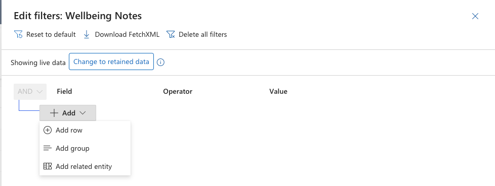

<!-- SOURCE ROW — delete before publishing
Epic:    Wellbeing (CE)
Feature: Create and Share a Wellbeing note
Area:    CE
Role:    School Admin, Office Admin
-->

# Filter and search wellbeing notes

The wellbeing notes list can be filtered on any column, and filters can be
combined. This is also how you build the result set before exporting — see
[Export wellbeing notes to Excel](./export-wellbeing-notes-to-excel.md).

1. Open the notes list

   In the **Wellbeing** area, open **Wellbeing notes**.

2. Add a filter row

   Click **Add row** to start a filter, then choose the column you want to
   filter on.

   

3. Set the condition

   Choose the operator and the value. Commonly used filters are:

   - **Wellbeing note type** equals a type, for example Environmental safety
   - **Priority** equals High
   - **Student profile** equals a named student
   - **Created on** — on, before or after a date
   - **Status** equals Active

4. Apply and combine

   Click **Apply**. Add further rows to narrow the results — for example
   priority High *and* status Active.

   > **Note:** Clear a filter row before adding a different one on the same
   > column, or the two conditions will fight each other and return nothing.
