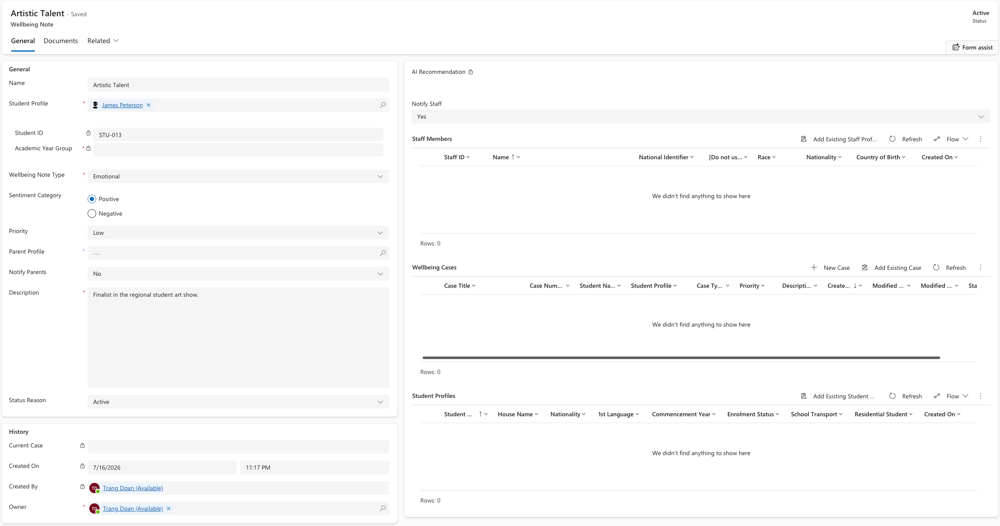

<!-- SOURCE ROW — delete before publishing
Epic:    Wellbeing (CE)
Feature: Create and Share a Wellbeing note
Area:    CE
Role:    School Admin, Office Admin
-->

# Update a wellbeing note

You can change the detail on an existing wellbeing note — for example when more
information comes to light and the concern turns out to be more serious than it
first looked. Changes are reflected wherever the note is surfaced, including on
the Staff Experience Platform.

1. Open the note

   In **Wellbeing notes**, open the note you want to change.

2. Change the detail

   Update any of the following:

   - **Name** — retitle the note
   - **Wellbeing note type** — for example switch from Physical to Environmental safety
   - **Sentiment** — for example from Neutral to Negative
   - **Priority**
   - **Description**

   

3. Change who is notified

   Set **Notify parents** to Yes or No. Set **Notify staff** to Yes and add or
   remove staff members in the staff subgrid.

4. Save

   Click **Save & Close**. The updated values appear straight away on the notes
   list and on the linked case.

   > **Note:** You need the right permissions to edit a note. Staff without
   > wellbeing write access can see the note but cannot change it.
