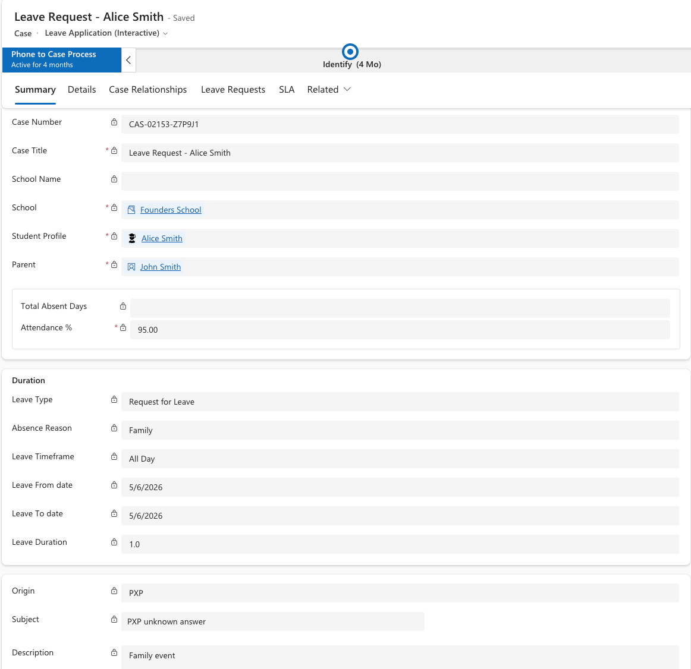

<!-- SOURCE ROW — delete before publishing
Epic:    Attendance (CE)
Feature: Leave & Absence Management
Area:    CE
Role:    School admin
-->

# Create a leave request

Leave requests start with the parent and finish as updated attendance records.
Parents raise them in the Parent Experience Platform; the request lands in CE as
a case, is approved by the attendance officer, and the student's attendance
records are then updated automatically.

1. The parent raises the request

   In the Parent Experience Platform, the parent selects the child, chooses
   whether the absence is a full day, AM or PM, picks a **Reason** — for example
   unwell, medical appointment or family — and can attach supporting
   documentation before submitting.

2. Find the case in CE

   The request arrives in CE as a case carrying everything the parent entered.
   Open it and check the detail.

   

3. Check the attendance records

   The case shows the existing attendance records for the student on the
   requested dates. Before approval these show an attendance category of
   *yet to be advised*.

4. Submit for approval

   Click **Submit for approval**. The request routes to the attendance officer
   configured for that school.

   > **Note:** The attendance officer is configured per school. Configuration by
   > year group is an enhancement in progress.

5. Approve

   The attendance officer approves the request.

6. Check the attendance updated

   Once approved, the attendance records for those dates update automatically —
   the category becomes **Absent** and the type is set from the reason the parent
   selected.

   

   > **Note:** Attendance is visible from the student profile under related
   > records, so you can check a student's history without going back to the
   > case.
