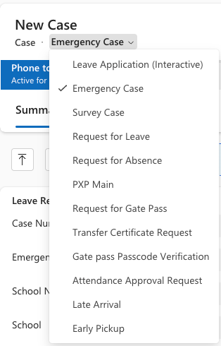
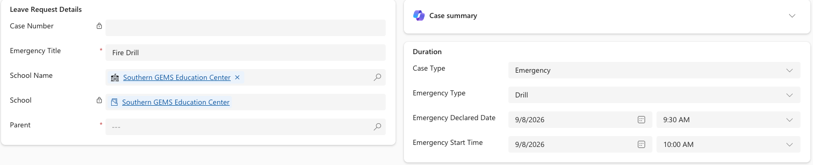

<!-- SOURCE ROW — delete before publishing
Epic:    Attendance (CE)
Feature: Emergency Attendance
Area:    CE
Role:    Attendance Officer, Principal / School Leader, School Admin, Teacher
-->

# Initiate Emergency

Declaring an emergency switches the school into emergency mode and generates the
roll that staff use to account for every student. It is normally the emergency
coordinator who does this.

1. Create the emergency case

   Under **Leave Management**, click **+ New** to create a new case. In the header, set the **Case type** to **Emergency Case**.

   

2. Set the emergency details

   Complete:

   - **School** — the school the emergency applies to
   - **Emergency type**
   - **Emergency declared date**
   - **Emergency start time**

   

4. Save

   Save the case. CE pulls every attendance record for that school where the end
   time is later than the emergency start time, and creates emergency attendance
   records from them.

   > **Note:** The start time matters. Only classes still running at that moment
   > are pulled in — anyone whose class had already finished is not treated as
   > being on site.

5. Confirm emergency mode is active

   The Staff Experience Platform shows **Emergency protocol activated** and
   attendance switches to emergency mode for teachers.

6. Stand down

   Once every student is accounted for, resolve the case. The school returns to
   normal attendance.
