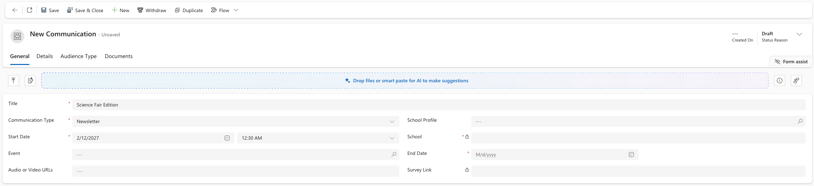

<!-- SOURCE ROW — delete before publishing
Epic:    Notices (CE)
Feature: Create and Share a Notice
Area:    CE
Role:    Office Admin, School Admin
-->

<!-- TODO — THIN SOURCE, UPDATE WHEN MORE INFORMATION IS AVAILABLE
Written from: Notices & Communications (21 Apr) 17:52-18:34 and 22:52,
where Meredith DEFINES what a newsletter is and Luke confirms newsletters can
only be created in CE.
Gap: a newsletter is never created on screen. No field list, no form layout, no
indication of how the standard sections are structured, or whether a template
exists. Meredith referenced a communication guide that would clarify the expected
sections — L&D does not have it.
Needs: a recording of a newsletter being created, and a copy of the communication
guide.
-->

# Create a newsletter

A newsletter is a school-level publication — closer to marketing and PR than to
an operational notice. It covers what has happened over the past fortnight,
usually with photos and stories, and typically carries standing sections such as
an update from the principal and updates from the heads of primary and secondary.

Like alerts, newsletters can only be created in CE, not in the Staff Experience
Platform (SXP).

1. Open a new newsletter

   In the **Administration** app, open the **Service Management** area and go to
**Communications**. Click **+ New** and choose **Newsletter** as the type.

2. Add the content

   Write the newsletter content, including the standard sections your school
   uses.

   

3. Set the audience and save

   Choose who receives the newsletter and save.

   > **Note:** Newsletters are normally produced on a fixed cycle, most often
   > fortnightly. Check your school's communication guide for the expected
   > sections and cadence.
