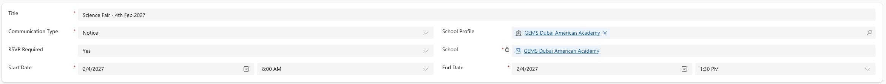

<!-- SOURCE ROW — delete before publishing
Epic:    Notices (CE)
Feature: Create and Share a Notice
Area:    CE
Role:    Office Admin, School Admin
-->

# Create a notice with RSVP enabled

Turning on RSVP lets recipients confirm they are coming, and sends them a
calendar invite when they do. Use it for anything with a headcount — parent
evenings, open days, reunions.

1. Create the notice

   Create the notice as usual — see [Create a notice](./create-a-notice.md).

2. Turn on RSVP

   Set **RSVP required** to Yes.

   > **Note:** Making RSVP mandatory also makes the date and time of the activity
   > mandatory. You cannot save without them.

3. Set the date and time

   Enter the date of the event and the start and end times. This is what goes
   into the calendar invite.

   

4. Set the audience and save

   Choose the audience as normal and save. Recipients see the RSVP option when
   they open the notice, and confirming adds the event to their calendar
   automatically.

   > **Note:** You are not notified when someone RSVPs. Check the notice record
   > to see responses.
