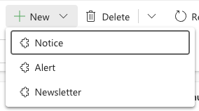
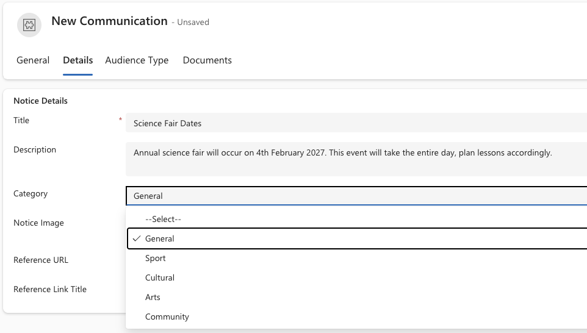

<!-- SOURCE ROW — delete before publishing
Epic:    Notices (CE)
Feature: Create and Share a Notice
Area:    CE
Role:    Office Admin, School Admin
-->

# Create a notice

Notices carry information about daily operations at school level — reminders,
changes, things a parent, student or staff member needs to know today. They are
one of three communication types created here; the others are alerts and
newsletters.

Most notices are raised in the Staff Experience Platform and land here
automatically. You create one directly in CE when you do not have SXP access.

1. Open Communications

   In the **Administration** app, open the **Service Management** area and go to
**Communications**. Click **New** and choose **Notice** as the type.

   

2. Fill in the general information

   Enter the notice title, set the **Start date** and **End date** with times,
   and select the **School**.

   Optionally link an **Event** or a **Survey**, and add an audio or video URL.

3. Add the content

   Go to **Details** and write the notice content. Choose the **Notice
   category** — General, Support, Cultural, Arts or Community. Add a notice
   image and a notice URL if you have one; the URL is what readers click through
   to for more detail.

   

4. Choose the audience

   Set the **Audience type** — Student, Parent, Staff, or a combination. Each
   choice determines where the notice surfaces: parent audiences appear in the
   Parent Experience Platform, staff audiences in the Staff Experience Platform.

   Narrow it further by **Year group**, **House** and **Campus**, or send it to
   named staff members directly.

   

5. Attach documents and save

   Upload any supporting documents on the **Documents** tab — these are stored
   in SharePoint — then save the notice.

   > **Note:** Notice visibility is driven by the start and end dates. A notice
   > with a future start date will not surface until that date arrives.
