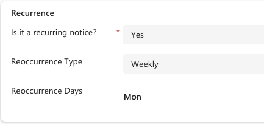

<!-- SOURCE ROW — delete before publishing
Epic:    Notices (CE)
Feature: Create and Share a Notice
Area:    CE
Role:    Office Admin, School Admin
-->

# Create a recurring notice

A recurring notice repeats on a pattern rather than being recreated each time.
Use it for anything that happens on a regular cycle — a monthly assembly, a
standing reminder.

1. Create the notice

   [Create a notice](./create-a-notice.md) as usual, then open the recurrence section.

2. Choose the pattern type

   Set the **Monthly recurrence pattern**. There are two types:

   - **Same day pattern each month** — the notice repeats on a set day, for
     example the 15th
   - **New pattern each month** — the notice repeats on a day ordinal, for
     example the first Monday of the month

   

3. Set the detail

   For a day ordinal, choose the ordinal and the weekday — for example, *first*
   and *Monday*. The pattern is written back onto the notice.

4. Save

   Save the notice. The experience platforms read the pattern and surface the
   notice on the right day each month.

   > **Note:** Recurrence is monthly. There is no daily or weekly pattern on
   > notices in this release.
