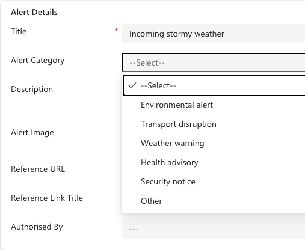

<!-- SOURCE ROW — delete before publishing
Epic:    Notices (CE)
Feature: Create and Share a Notice
Area:    CE
Role:    Office Admin, School Admin
-->

<!-- TODO — THIN SOURCE, UPDATE WHEN MORE INFORMATION IS AVAILABLE
Written from: Notices & Communications (21 Apr) 23:14-31:12 and 39:57-41:47.
Gap: the alert form is reviewed live rather than completed — the presenter states
"I won't create the things over here because it's pretty similar to notices".
Meredith then gives field-level corrections ON CAMERA that have not yet been
made: remove RSVP and recurrence from alerts, simplify the audience to
parent/student/staff only (remove year group, house, campus), hide the Channel
content tab, and change the label "who can see the notice" to "who can see the
alert". This page describes the intended alert, not necessarily the current build.
Needs: confirmation those changes have landed, then a re-check of the field list.
-->

# Create an alert

Alerts are urgent and critical by nature — extreme weather, a move to remote
learning, a security issue. They are deliberately restricted: only a small number
of senior roles can create them, and they can only be created here in CE, never
in the Staff Experience Platform. Everyone can *see* alerts in SXP; they just
cannot raise them.

1. Open a new alert

   In the **Administration** app, open the **Service Management** area and go to
**Communications**. Click **New** and choose **Alert** as the type.

2. Set the alert category

   Choose the **Alert category** — Environmental, Transport, Weather, Health or
   Security. This is the main thing that distinguishes an alert from a notice.

   

3. Write the content

   Keep it short. Alerts are intended as brief, critical messages pointing people
   to what they need to do or where to go for detail.

4. Choose who gets it

   Set the audience to parents, students and/or staff.

   > **Note:** Alerts are broadcast communications. Unlike notices, they are not
   > intended to be narrowed down to a single year group or house.

5. Save

   Save the alert. It surfaces under **Alerts** in the notifications area of the
   experience platforms, separately from product-triggered messages.
