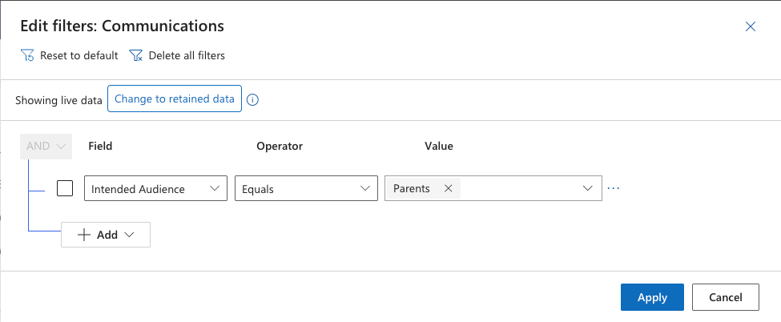

<!-- SOURCE ROW — delete before publishing
Epic:    Notices (CE)
Feature: View and Search Notices
Area:    CE
Role:    Office Admin, School Admin
-->

<!-- TODO — THIN SOURCE, UPDATE WHEN MORE INFORMATION IS AVAILABLE
Written from: SXP - CE - Notices (20 July) 8:06-9:15, which is the only
recording showing the CE notices list.
Gap: that recording demonstrates ADDING A COLUMN and SORTING to find the latest
record — it never filters by audience. No filter on any audience field is shown
in CE in any recording. The column names available for audience filtering are
unconfirmed.
Needs: a short walkthrough of the CE list filters on Communications.
-->

# Filter notices by audience

Filter the communications list to see only notices aimed at a particular
audience — for example everything sent to parents, or everything targeted at a
year group.

1. Open the list

   In the **Administration** app, open the **Service Management** area and go to
**Communications**.

2. Add a filter row

   Open the filter panel and add a row. Choose the audience column you want to
   filter on.

3. Set the value and apply

   Choose the operator and value, then apply. Add further rows to combine
   conditions.

   

   > **Note:** Audience selections are held as child records against the notice.
   > Where a notice targets several audiences, it will match a filter on any one
   > of them.
