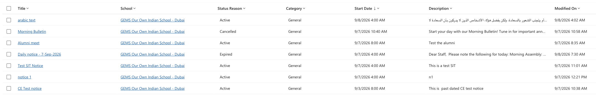

<!-- SOURCE ROW — delete before publishing
Epic:    Notices (CE)
Feature: View and Search Notices
Area:    CE
Role:    Office Admin, School Admin
-->

<!-- TODO — THIN SOURCE, UPDATE WHEN MORE INFORMATION IS AVAILABLE
Written from: SXP - CE - Notices (20 July) 8:45-9:15.
Gap: the recording shows a column being added and sorted by created date. No
date-RANGE filter is ever built in CE. The available date columns and operators
are unconfirmed.
Needs: a short walkthrough of date filtering on the Communications list.
-->

# Filter notices by date range

Filter the communications list by when notices were created or when they were
live.

1. Open the list

   In the **Administration** app, open the **Service Management** area and go to
**Communications**.

2. Add a date filter

   Open the filter panel, add a row, and choose the date column — **Start date**,
   **End date** or **Created on**.

3. Set the condition and apply

   Choose the operator — on, before, after, or between — set the date, and apply.

   

   > **Note:** To find the most recently created notices without building a
   > filter, add the created date as a column and sort it newest first.
