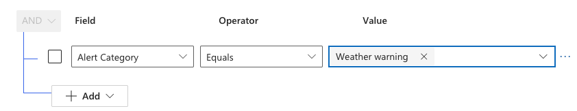

<!-- SOURCE ROW — delete before publishing
Epic:    Notices (CE)
Feature: View and Search Notices
Area:    CE
Role:    Office Admin, School Admin
-->

<!-- TODO — THIN SOURCE, UPDATE WHEN MORE INFORMATION IS AVAILABLE
Written from: Notices & Communications (21 Apr) 1:24-1:57, which confirms
Notice, Alert and Newsletter are types under the same Communications table and
that Circular is a separate table.
Gap: filtering by type is never demonstrated in any recording. The exact field
name for the type column is not captured on screen.
Needs: confirmation of the type field name and a short filtering walkthrough.
-->

# Filter notices by type

Notices, alerts and newsletters are all held in **Communications**. Filter by
type to see just one of them.

1. Open the list

   In the **Administration** app, open the **Service Management** area and go to
**Communications**.

2. Filter on the type

   Open the filter panel, add a row on the communication type, and choose
   **Notice**, **Alert** or **Newsletter**.

3. Apply

   Apply the filter. Combine it with a category filter to narrow further — for
   example alerts with the category Weather.

   

   > **Note:** Circulars are held in a separate table and will not appear in this
   > list, whatever type filter you apply.
