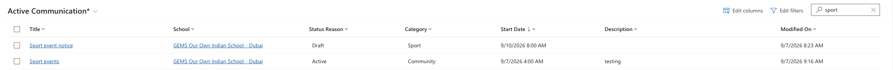

<!-- SOURCE ROW — delete before publishing
Epic:    Notices (CE)
Feature: View and Search Notices
Area:    CE
Role:    Office Admin, School Admin
-->

<!-- TODO — THIN SOURCE, UPDATE WHEN MORE INFORMATION IS AVAILABLE
Written from: no direct source.
Gap: searching the Communications list is not demonstrated in ANY recording.
This page describes the standard list search behaviour and has been written so
the topic is not left empty, but nothing here has been verified against the
build — including whether search covers the notice content as well as the title.
Needs: a short walkthrough of search on the Communications list. Treat this page
as unverified until then.
-->

# Search notices by title or keyword

Use search when you know roughly what the notice was called and want to get to it
quickly.

1. Open the list

   In the **Administration** app, open the **Service Management** area and go to
**Communications**.

2. Search

   Type the title or a keyword into the list search box and run the search.

3. Open the result

   Open the matching notice to check its detail — see
   [View notice details](./view-notice-details.md).

   

   > **Note:** If a search returns nothing, check you are not still filtered to a
   > narrower set of records from a previous session.
