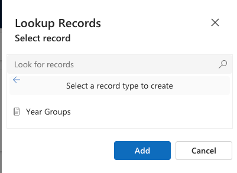

<!-- SOURCE ROW — delete before publishing
Epic:    Notices (CE)
Feature: Edit and Manage a Notice
Area:    CE
Role:    Office Admin, School Admin
-->

<!-- TODO — THIN SOURCE, UPDATE WHEN MORE INFORMATION IS AVAILABLE
Written from: Notices & Communications (21 Apr) 7:18-9:12 for how the
audience is set at creation, and SXP - CE - Notices (20 July) 6:59-7:21 where the
audience is edited and republished — but from the SXP side, not CE.
Gap: editing the audience on an existing notice is never performed on the CE
form. The child-record behaviour on edit (does removing a campus delete the
record?) is inferred, not observed.
Needs: a CE-side walkthrough of editing the audience on an existing notice.
-->

# Update notice audience (add/remove year groups, houses, campuses)

Change who sees an existing notice without recreating it — for example widening
it from one year group to two, or adding a second campus.

1. Open the notice

   In the **Administration** app, open the **Service Management** area and go to
**Communications**. Open the notice you want to change.

2. Change the audience

   In the audience section, add or remove entries for:

   - **Audience type** — Student, Parent, Staff
   - **Year group**
   - **House**
   - **Campus**
   - Named staff members

   

3. Save

   Save the notice. Each audience selection is stored as its own child record
   against the notice, so adding a campus creates a new record rather than
   editing an existing one.

   > **Note:** Widening the audience on a notice that is already live means new
   > recipients see it immediately. Check the start and end dates are still what
   > you want before saving.
