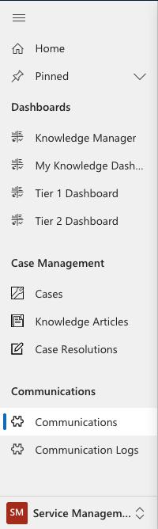
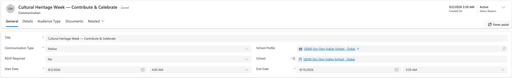

<!-- SOURCE ROW — delete before publishing
Epic:    Notices (CE)
Feature: View and Search Notices
Area:    CE
Role:    Office Admin, School Admin
-->

# View notice details

Every notice — including those raised in the Staff Experience Platform — is
stored here as a record. This is where you go to confirm exactly what was sent
and to whom.

1. Open Communications

   In the **Administration** app, open the **Service Management** area and go to
**Communications**. All notices created in SXP populate this list.

   

2. Find the notice

   Add a column for the created date and sort newest first to bring the most
   recent notices to the top.

3. Open the record

   Open the notice. Check:

   - The title and the **Notice category**
   - The content on the **Details** tab
   - **RSVP required**, where it was set
   - The start and end dates

   

4. Check the audience

   The audience selections are stored as child records — one set for the
   audience types chosen, one for each **House**, and one for each **Campus**.
   Check these against what was intended, particularly for notices raised in SXP.

   > **Note:** If a notice is not appearing for someone who should see it, the
   > audience records are the first place to look.
