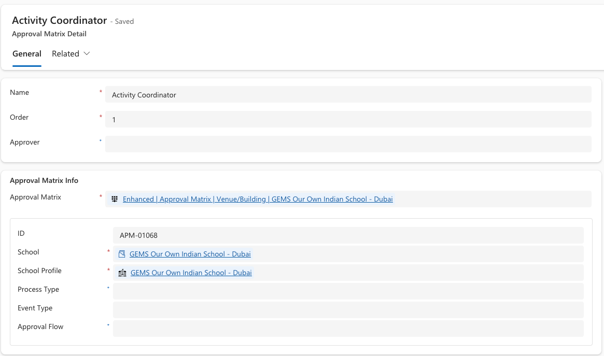

<!-- SOURCE ROW — delete before publishing
Epic:    School Off-Site Activities (CE)
Feature: Configuration
Area:    CE
Role:    IT Admin, School admin
-->

# Assign approvers — who will approve which activity type

Activity approvers work the same way as event approvers — the matrix decides.
Change who approves a given activity type by editing the matrix that matches it.

1. Find the matrix

   Go to **System Settings**, open **Approval matrices**, and locate the matrix
   for the school and activity type.

2. Open the approver row

   Open the **Approval matrix detail** row for the level you want to change.

3. Change the approver and save

   Select the new approver and click **Save & Close**.

   

   > **Note:** An approver does not have to be the person who owns the activity.
   > A request can be raised by one member of staff and assigned to another for
   > decision.
