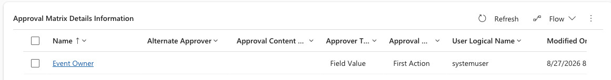

<!-- SOURCE ROW — delete before publishing
Epic:    School & Corporate Events (CE)
Feature: Configuration
Area:    CE
Role:    IT Admin, School admin
-->

# Assign approvers — who will approve which event type

Which event types a person approves is decided by which approval matrices they
appear on. To change an approver, edit the matrix rather than the event.

1. Find the right matrix

   Go to **System Settings**, open **Approval matrices**, and find the matrix for
   the school and event type you want to change.

2. Open the approver row

   Open the **Approval matrix detail** row for the level you are changing. The
   **Order number** tells you where in the sequence this approver sits.

   

3. Change the approver

   Select the new approver and click **Save & Close**.

4. Add a level if needed

   To add an extra level of approval, create a new detail row with the next
   **Order number** and select the approver.

   > **Note:** Approvers are notified by email and in Teams when a request
   > reaches them, and can approve from the event record itself. If someone
   > reports not receiving requests, check they are on the matrix that matches
   > that school and event type.
