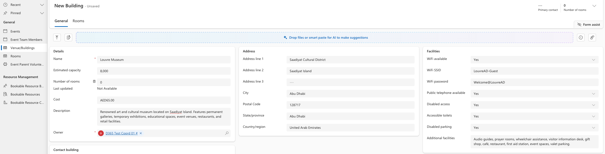

<!-- SOURCE ROW — delete before publishing
Epic:    School Off-Site Activities (CE)
Feature: Venue Management
Area:    CE
Role:    IT Admin, School admin
-->

<!-- TODO — THIN SOURCE, UPDATE WHEN MORE INFORMATION IS AVAILABLE
Written from: Event & Excursions (7 May) 39:58-47:08.
Gap: the venue approval segment is where the demo runs into trouble. The
approver receives neither the email nor the Teams notification on camera, the
presenter cannot locate a prior email activity on the timeline, and the segment
ends with "better that I can, I will check and get back to you". The
notification routing is therefore unverified. Venue APPROVAL and REJECTION as a
completed flow is never demonstrated end to end.
Needs: a re-recording of venue creation through to approval, with the
notification working.
-->

# Configure approval for venue

New venues and buildings are approved before they can be used on an event. The
approval is raised automatically when the venue record is created, and routed
using the approval matrix.

1. Create the venue

   Add the new venue or building. Set whether it is **Internal** or **External**,
   select the **School**, and set the **Type**.

   

2. Check the approval record

   An approval record is created against the venue automatically. The approver
   is determined by the approval matrix that matches the school and process type.

3. Approve or reject

   The approver opens the record and clicks **Approve** or **Reject**. Once a
   decision has been made, the buttons no longer appear on the record.

   > **Note:** Approvers should receive an email and a Teams notification linking
   > them to the record. If notifications are not arriving, the approver can
   > still open the approval request directly from the venue.

4. Confirm the venue is usable

   Once approved, the venue can be selected on an event, and selecting it pulls
   the venue detail through onto the event.
