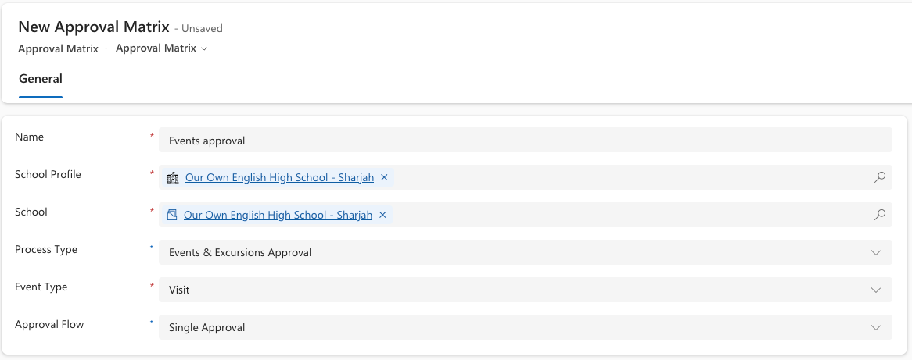

<!-- SOURCE ROW — delete before publishing
Epic:    School Off-Site Activities (CE)
Feature: Configuration - Approval
Area:    CE
Role:    IT Admin, School admin
-->

<!-- TODO — THIN SOURCE, UPDATE WHEN MORE INFORMATION IS AVAILABLE
Written from: Event & Excursions (7 May) 13:28-19:47, which walks the
matrix in full but builds it for an EVENT, and School & Corporate Events
CE001/CE002 (27 July), which builds a corporate events matrix end to end.
Gap: the activity variant of the matrix is never built on screen. We are
inferring that it works identically with a different process type / event type.
Needs: confirmation that off-site activities use the same matrix entity, and the
exact process type values available for activities.
-->

# Configure approval matrix for activity approvers

Off-site activities are approved through the same approval matrix mechanism as
events. What changes is the **process type** and **event type** you match on, and
therefore who ends up approving.

1. Open Approval matrices

   Go to **System Settings** and open **Approval matrices**. Click **New
   matrix**.

2. Match on the activity

   Set the **School profile**, then the **Process type** and the **Event type**
   for the activity you are configuring — for example Excursion or Visit.

   

3. Choose how approval runs

   Set the **Approval flow**:

   - **Single** — one approver decides
   - **Sequential** — approvers are approached one after another, in order
   - **Parallel** — approvers are approached at the same time

4. Add the approvers

   Save, then add an **Approval matrix detail** row per approver with an
   **Order number** and the approver's name.

5. Save and confirm active

   Save and close. Any activity matching the school, process type and event type
   now routes through this matrix.

   > **Note:** Where several matrices could match the same activity, duplicates
   > cause unpredictable routing. Keep one active matrix per combination.
