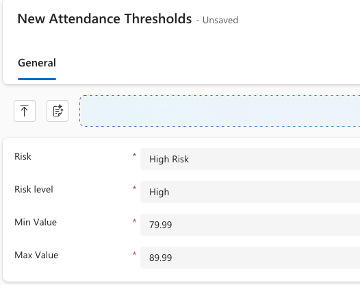

<!-- SOURCE ROW — delete before publishing
Epic:    Agent setup (CE)
Feature: Attendance Compliance Checker Agent
Area:    CE
Role:    School Admin
-->

<!-- SOURCE — 3 Sep 2026 SXP Agent Demo, Attendance Compliance and Student Leaver
Request (0:07–4:00), demonstrated by Peter Nguyen; 26 Aug 2026 Agent walkthrough
(4:46–11:40).
TO RE-VERIFY BEFORE PUBLISHING:
(1) The regional policy check that flags a threshold breaching the regulator
    (Peter's KHDA 95% example, 26 Aug 10:33–11:40) was described as intended.
    It was not shown on screen and may not be built — confirm before publishing
    the note at the end of step 3.
(2) Peter stated there is currently no validation cross-checking the threshold
    name against the risk level.
No screenshots available — add to ./images/ from a UAT build. -->

# Set attendance risk thresholds

The attendance compliance checker sorts students into risk bands by comparing their
attendance percentages against thresholds you set. Until these exist, the agent has nothing to
measure against — it cannot band students, and the leave request approver cannot
assess whether a student is at risk either.

Thresholds are set **per school**, because schools do not all work to the same
attendance values.

1. Open the threshold settings

   There are two routes to the same setting — use whichever suits you:

   - In the administrator app, go to **System settings ▸ Settings ▸ Active Attendance Threshold**.
   - Or open the **School profile** and go to the **System management** module, then **Attendance threshold**.

   > **Note:** The school profile view lists the thresholds in ascending order,
   > which makes it easier to see the bands as a set and spot a gap. Use it when
   > you are reviewing what a school already has.

2. Add a threshold

   Click to add a new threshold and complete:

   - **Risk** — what the band is called at your school, for example *High risk*.
   - **Risk level** — **High**, **Medium** or **Low**.
   - **Min Value** and **Max Value** — the attendance percentages the band covers. Decimals are accepted, so 91.99 is valid.

   > **Note:** The name and the risk level are not cross-checked. Nothing stops you
   > naming a band *High risk* and setting its level to **Low**, so check them
   > against each other before saving.

   

3. Cover the whole range

   Thresholds work as ranges, not as single cut-off points, and the agent needs an
   unbroken run from 0% upwards. A school might set 0–92% as high, 92–94% as medium
   and 94–96% as low, with anything above 96% treated as compliant.

   - You cannot save a band without both a minimum and a maximum.
   - You cannot save a second band at the same risk level.
   - Overlapping ranges are rejected — saving 80–90 as high when 0–92 is already high returns *the range 80 to 90 overlaps with an existing high threshold*.

   > **Note:** Most schools keep to three bands — low, medium and high. You can add
   > more, but each one still has to fit the range without gaps or overlaps.

4. Save

   Save the threshold. It takes effect on the agent's next scheduled run.

## Who sets this up

The school admin. The thresholds depend on the school's own policy and on the
regulator it answers to, which is not something the implementation team can decide
for you. Where a school prefers, the team can load the initial values at system
level — but the school still needs to be able to change them later, since
regulations and policies move.

> **Note:** Set thresholds that keep the school compliant with its regulator. If
> the regulator requires 95% attendance and the school sets its risk level at 85%,
> students who breach the regulation are never flagged.
