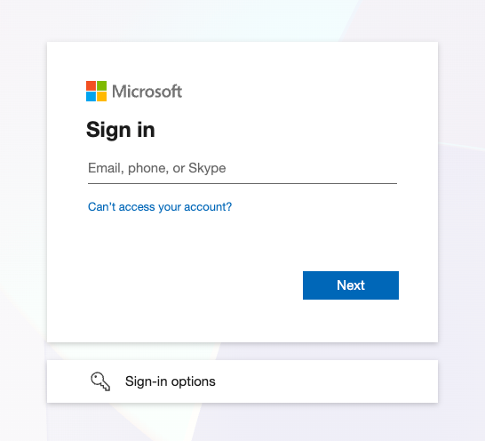

# Sign in to Employee Self-Service

ESS uses your GEMS Microsoft 365 account — the same login you use for your email. There is no separate password to remember.

1. Open the ESS portal

   Navigate to the ESS portal URL. Your IT team or HR will have provided this link.

2. Sign in with Microsoft

   Click **Sign in with Microsoft** and enter your **GEMS Microsoft 365** email address and password. If you are already signed into your Microsoft account on this device, you may be signed in automatically.

   

3. Land on your home page

   Once signed in, you arrive at your personalised ESS home page with tiles for your profile, tasks, questionnaires, and more.
