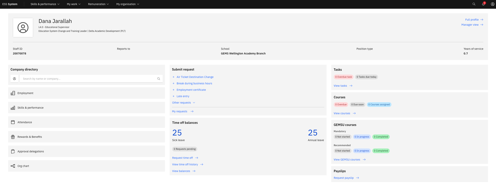

# Find your way around ESS

ESS is built around a home page of tiles. Click any tile to go directly to that area — no menus to dig through.

1. Use the tiles on your home page

   When you log in, you see tiles for each area available to you:

   | Tile | What you'll find there |
   |---|---|
   | **My Profile** | Your personal details, identification, contacts, payment information, skills, and certifications |
   | **Tasks/Onboarding** | Checklists of tasks assigned to you |
   | **Submit request** | Submit request items to HR |
   | **Courses** and **GEMSU courses** | Lists of courses overdue, due soon or assigned courses |
   | **Company Directory** | Search for colleagues by name or reporting manager |
   | **Org chart** | Visual view of your team structure and reporting lines |

   

2. Check the notification bell

   The bell icon in the top-right corner alerts you when action is needed — for example, when a document is approaching expiry, a new questionnaire is assigned, or a new approval request is submitted. Click a notification to jump directly to the relevant record.

3. Navigate back to home

   To return to the home page at any time, click **ESS System** in the navigation bar or use your browser's back button. ESS runs in any web browser — there is nothing to install.
