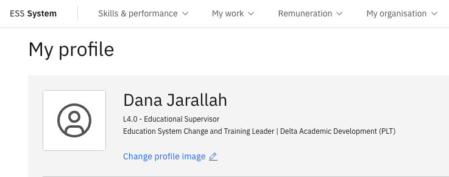

# Update your profile image

1. Open your Full Profile

   From the ESS home page, navigate to your **Full profile →** on the right side of your profile tile.

2. Open the image upload
        
   Click **Change profile image**.

   

3. Choose your photo

   Select an image from your device and click **Open**.

   Your image submission is routed through an approval workflow. A notification confirms receipt, and it will remain pending until it is approved by HR or your line manager.
