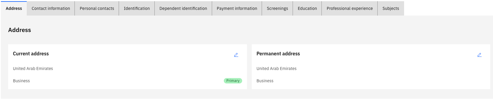

# Manage your address

Your profile must always have at least one address marked as your primary residence. Address changes are applied immediately without an approval workflow.

1. Open the Address tab

   From your **Full Profile**, click the **Address** tab.

   

2. Add a new address

   Click the relevant address tile and complete the fields: description, purpose, street, city, and country.

3. Set a primary address

   Select an address and enable the **Primary Residence** toggle to mark it as primary. The primary address pins to the top of the list.

4. Edit an existing address

   Click the **pencil icon** on any address to update its details.

5. Submit your changes

   Click **Submit** to save.

   > **Note:** You cannot delete your primary address. Assign another address as primary first, then delete the original.

6. Delete a non-primary address

   Select the address you want to remove and click **Delete**, then confirm by clicking **Submit**.
