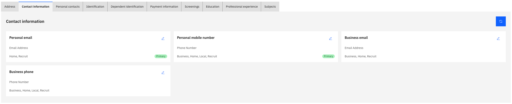

# Manage your contact information

The Contact Information tab lets you manage your phone numbers, email addresses, and other contact details. Changes are applied immediately without an approval workflow.

1. Open the Contact Information tab

   From your **Full Profile**, click the **Contact Information** tab.

   

2. Add a new contact record

   Click **Add New Contact** and complete the fields:
   - **Contact type** — for example, phone or email
   - **Number or address** — the phone number or email address
   - **Purpose** — for example, home or local
   - **Primary** — toggle on if this is your main contact method

3. Edit an existing contact

   Click the **pencil icon** on a contact record to update its details.

4. Submit

   Click **Submit** to save. A confirmation prompt may appear — click **Yes** to proceed.
