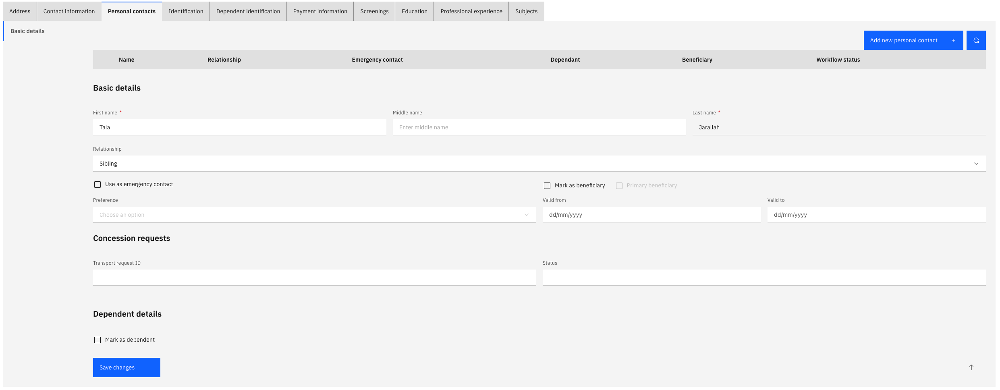

# Add a personal contact or dependent

The Personal contacts tab lets you record family members, emergency contacts, dependents, and beneficiaries. This information is used for processes such as tuition fee and transport concession eligibility — marking a child as a full-time student is required for those requests.

1. Open the Personal contacts tab

   From your **Full Profile**, click the **Personal contacts** tab.

2. Add a new contact

   Click **Add New Personal Contact +**.

3. Complete Basic Details

   Fill in the contact's name and relationship type. Toggle on **Emergency contact** or **Beneficiary** flags as appropriate. If the contact is a beneficiary, enter the date range and indicate whether they are the primary beneficiary.

   Three buttons are available at the bottom of each sub-tab:
   - **Save** — saves and stays on this sub-tab
   - **Next** — saves and moves to the next sub-tab

   

4. Complete the remaining sub-tabs

   Work through the following tabs, filling in what is relevant:

   | Sub-tab | What to record |
   |---|---|
   | **Dependent Details** | Gender, date of birth, student status, disability, order eligibility. Set **Full-Time Student** if applicable — this is required for tuition fee and transport requests |
   | **Dependent Address** | Address details for the dependent |
   | **Dependent Contact Information** | Phone numbers and email for the dependent |

5. Save

   Click **Save** when you have completed all relevant tabs.
