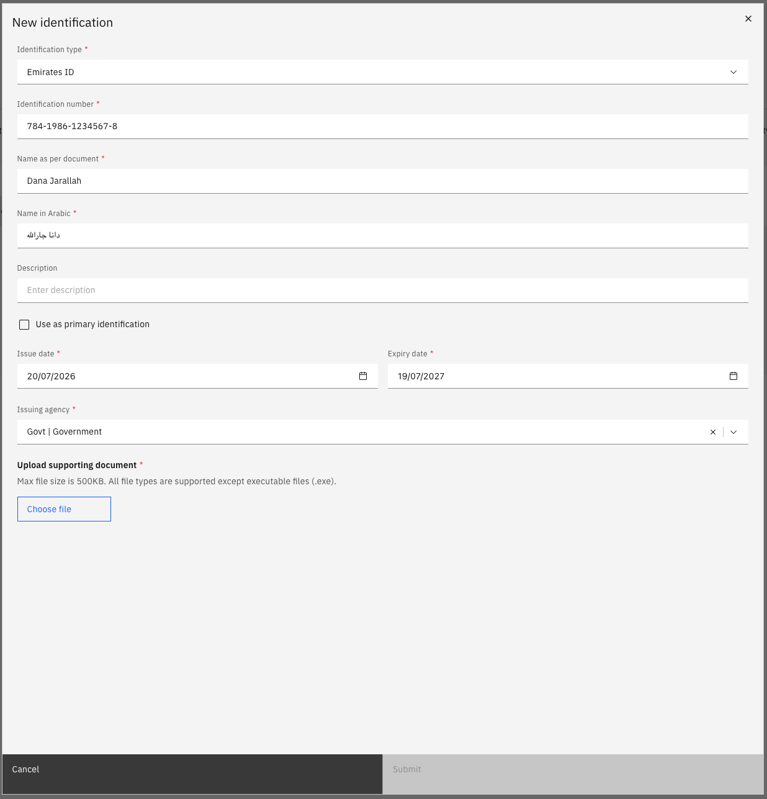

# Record an identification document

Identification documents are submitted through ESS and reviewed by HR before they become active. Once submitted, you cannot make changes to the record until it has been processed.

1. Open the Identification tab

   From your **Full Profile**, click the **Identification** tab. Only your current active identification document is shown by default.

2. Add a new record

   Click **Add New** to start a new identification record.

3. Select the document type

   Choose the **Identification type** from the dropdown — for example, Passport, Emirates ID, or Labour Card. The form updates to show the fields relevant to that document type.

4. Complete the required fields

   Enter the:
   - **Identification number**
   - **Issuing authority**
   - **Valid from** and **expiry dates**

5. Upload the document

   Click **Choose file** to attach a copy of the identification document. If the document type requires an attachment, the **Submit** button is disabled until a file is uploaded.

   

6. Submit for approval

   Click **Submit** to send the record to HR for review. The record status shows as **Pending** until approved.

   When a document is approaching its expiry date, an **Expiring Soon** label appears on the tab and a notification appears in the bell icon at the top of the screen.
