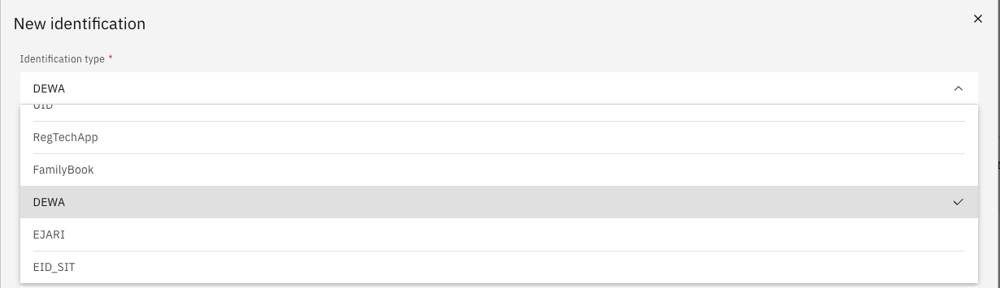

# Add DEWA or Ejari information

DEWA (Dubai Electricity and Water Authority) account and Ejari tenancy registration details are recorded under the Identification tab and are required for certain housing and utility-related HR processes.

1. Open the Identification tab

   From your **Full Profile**, click the **Identification** tab.

2. Add a new record

   Click **Add new identification +**.

3. Select the document type

   From the **Identification type** dropdown, choose **DEWA** or **Ejari** as appropriate.

   

4. Complete the required fields

   Fill in the required details for the selected type.

5. Upload documentation

   Click **Choose file** to attach a copy of your DEWA or Ejari documentation.

6. Submit

   Click **Submit** to save the information.
