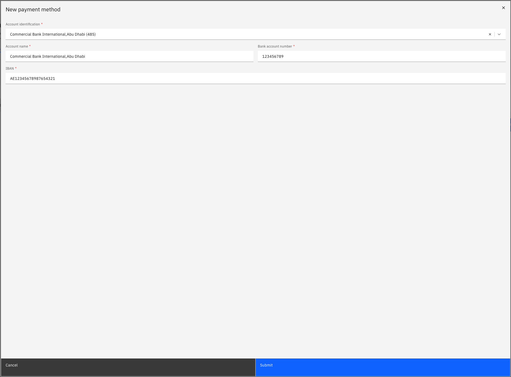

# Update your payment information

Your payment information records the bank account where your salary is deposited. Only one account can be active at a time.

1. Open the Payment information tab

   From your **Full Profile**, click the **Payment information** tab. Only your active account is shown in ESS — inactive accounts are filtered out.

2. Add a new payment method

   Click **Add new payment method** and complete the required fields:
   - Bank name
   - Account name
   - Account number
   - IBAN

   

3. Set the account to active

   Toggle the account status to **Active** to designate this as your current salary account.

4. Submit

   Click **Submit** to save your changes.

   Changes to payment information go through an approval workflow before becoming active. If you are replacing an existing account, the previous account will be marked inactive once the new one is approved. The system also performs a duplicate IBAN check on submission.
