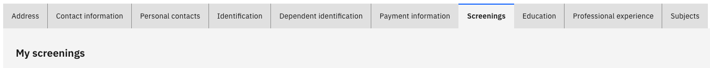

# View your screenings

The Screenings tab displays compliance and pre-employment screening checks associated with your profile. HR configures which checks are visible to you, so this tab shows only what is relevant to your role.

1. Open the Screenings tab

   From your **Full Profile**, click the **Screenings** tab.

2. Review your screenings

   The list shows all screening checks assigned to you. Click on any item to see its full details.

   

3. Update a screening (if permitted)

   Most screening records are read-only. If an item has been enabled for employee action, click **Add new screening**, enter the relevant details, and click **Submit**. Not all employees have permission to add screenings.
