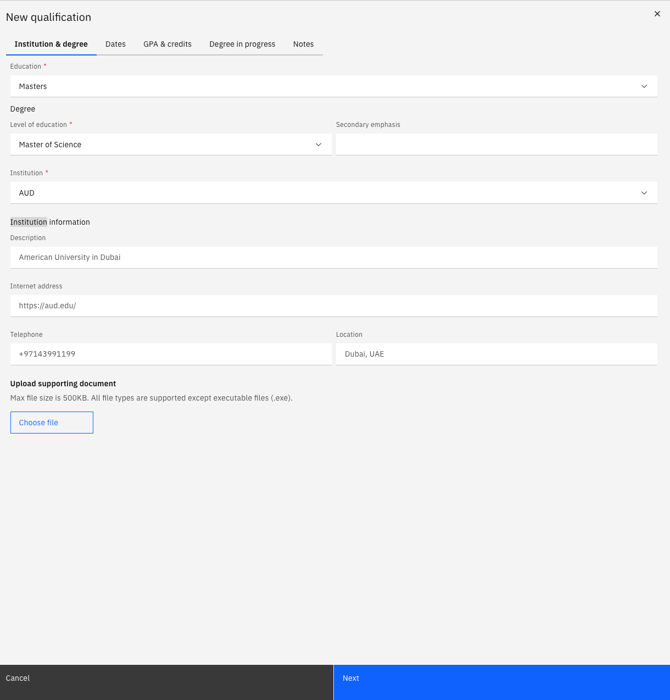

# Add an education record

Education records are submitted through ESS and reviewed by HR before they appear as active on your profile.

1. Open the Education tab

   From your **Full Profile**, click the **Education** tab.

2. Add a new qualification

   Click **Add New Qualification**.

3. Select the qualification type

   Choose the **Education type** from the dropdown — for example, Masters or Bachelors.

4. Complete the details

   Fill in the relevant fields: field of study, institution, start date, and completion status.

5. Upload your certificate

   Click **Choose file** to attach your certificate and transcripts.

   

6. Continue through tabs

   Click **Next** to move through any additional tabs and complete the remaining information if required.

7. Submit for approval

   Click **Submit** to send the record for HR review. The status shows as **In Review** until approved. Once approved, the qualification appears on your profile immediately.
