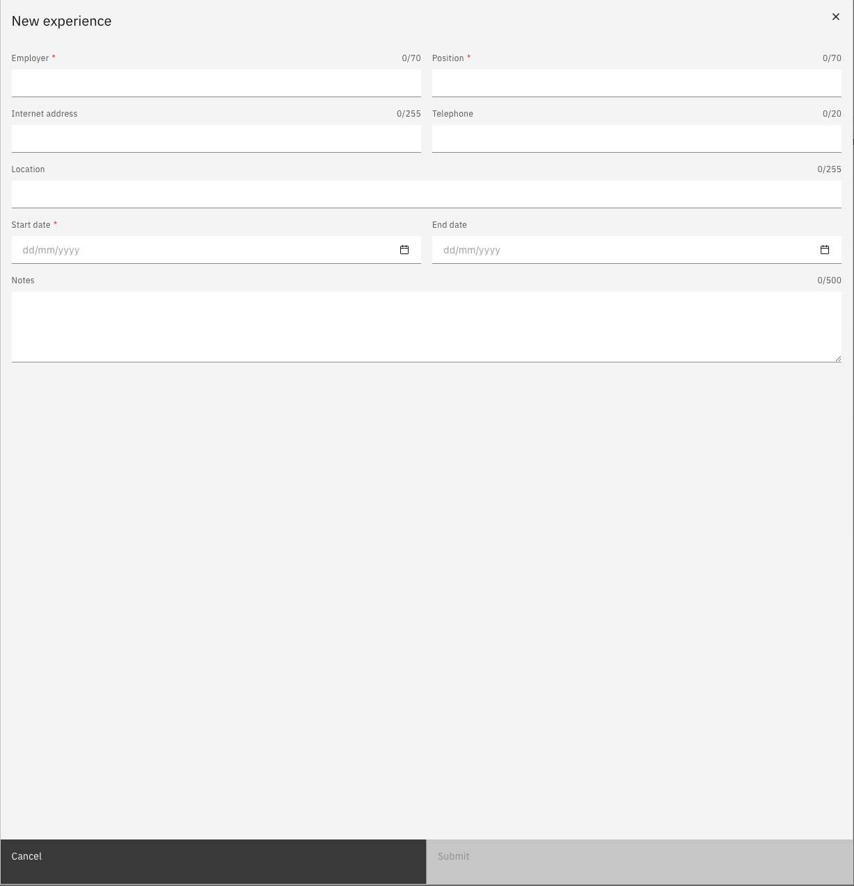

# Add a professional experience record

Professional experience records capture your previous employment history. All submissions go through an approval workflow before being confirmed on your profile.

1. Open the Professional Experience tab

   From your **Full Profile**, click the **Professional Experience** tab.

2. Add a new record

   Click **Add New Experience**.

3. Enter the details

   Fill in the required fields: previous job title, organisation, and a description of your responsibilities.

   

4. Submit for approval

   Click **Submit** to send the record for review.
