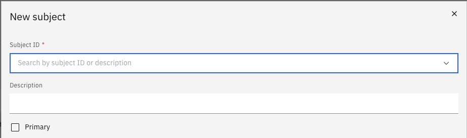

# Manage your subjects

The Subjects tab lets you declare the subjects you are qualified or available to teach. Subject submissions are routed through the approval workflow.

1. Open the Subjects tab

   From your **Full Profile**, click the **Subjects** tab.

2. Add a subject

   Click **Add New Subject**.

3. Select the subject

   Search by keyword or select a subject from the dropdown list using the subject ID or description.

   

4. Set as primary (optional)

   Toggle the **Primary** flag if this is your main teaching subject.

5. Submit for approval

   Click **Submit** to send the record for review.
