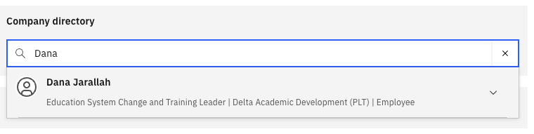

# Search the company directory

The Company Directory lets you find any colleague's contact details, department, and position across the organisation.

1. Open Company Directory

   From the ESS home page, navigate to **Company directory**.

2. Search for a colleague

   Type a colleague's **name** or their **reporting manager's name** in the search bar.

   

3. View the results

   The matching employee profile is displayed, showing key details such as name, job title, department, and location.
