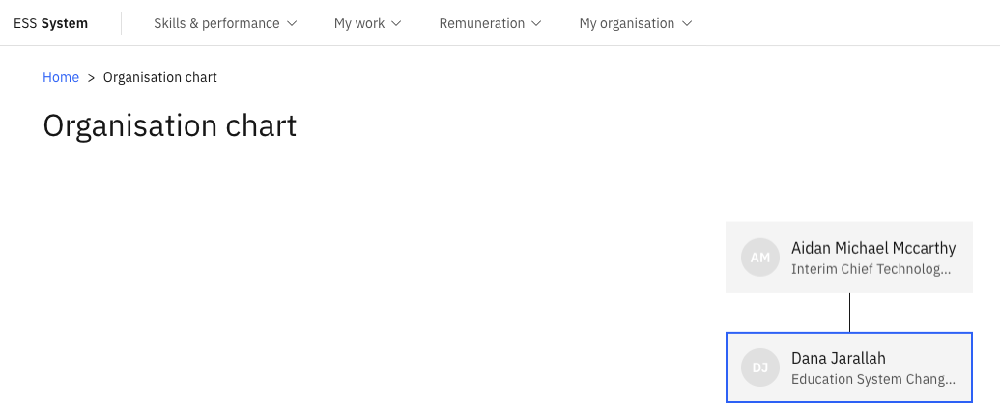

# View the organisational hierarchy

The Org chart provides a live visual of the organisation's reporting structure, updated directly from Dynamics 365. Any changes to the structure appear immediately on refresh.

1. Open the Org chart

   From the ESS home page, navigate to **Org chart**.

2. Explore the hierarchy

   The chart displays employee photos (where available), names, and reporting relationships. Mouse over any person's name to see their details.

   

3. Navigate levels

   Click on any person in the chart to move to their part of the hierarchy and explore their team structure.

   The initial load may take a few seconds. Once loaded, navigation between levels is instant.
