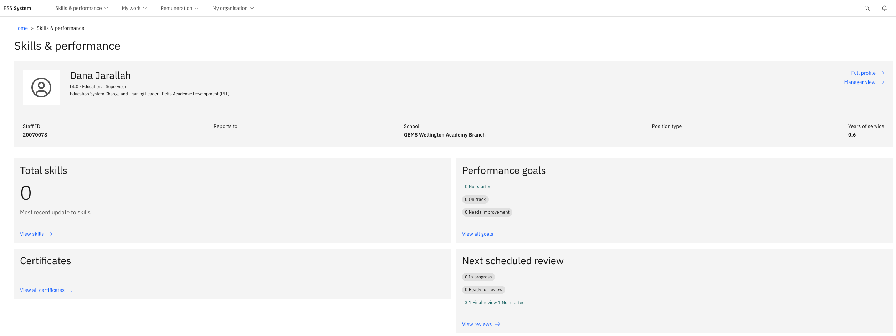

# Manage your certifications

The certifications section tracks your professional and compliance certificates, monitoring expiry dates and surfacing alerts when renewal is needed.

1. Open your certificates

   From the ESS home page, locate the **Skills & performance** tile and click **View All Certificates**.

2. Review certificate statuses

   Each certificate shows one of the following statuses:

   | Status | Meaning |
   |---|---|
   | **Valid** | Current — no action needed |
   | **Expiring** | Approaching expiry — action recommended |
   | **Expired** | Past expiry date — renewal required |
   | **Invalid** | Marked as no longer valid |

   You will also receive expiry notifications through the **notification bell** on the ESS home screen.

   

3. Add a new certificate

   Click **Add new certificate**.

4. Complete the details

   Select the **Certificate type**, enter the relevant dates and details.

5. Upload the document

   Click **Choose file** to attach a copy of the certificate.

6. Submit

   Click **Submit** to save the record.
