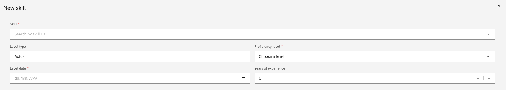

# Manage your skills

The skills section lets you keep your competency profile current. Any skill you add or update is routed through an approval workflow with your manager or HR.

1. Open your skills

   From the ESS home page, locate the **Skills & performance** tile and click **View skills**.

2. Review existing skills

   Your current skills are listed with their status. You can filter or search by keyword or skill type.

   

3. Add a new skill

   Click **Add new skill**.

4. Complete the details

   Select the **Skill type**, then enter:
   - Proficiency level
   - Date acquired
   - Years of experience

5. Submit for approval

   Click **Submit** to send the record for review. The skill remains pending until approved by your manager or HR.
