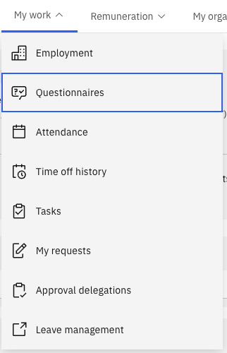
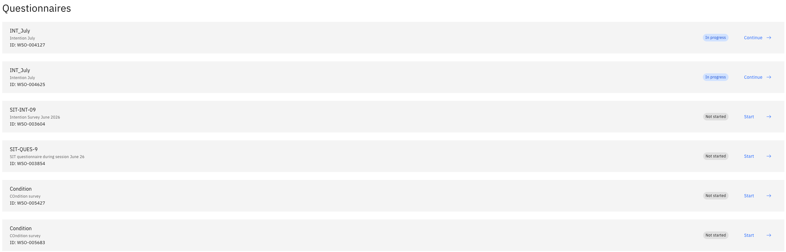

# Complete a questionnaire

Questionnaires are assigned by HR and appear in the Questionnaires tab of your ESS portal. You can save your progress and return later if needed.

1. Open the Questionnaires tab

   From the ESS portal, click the **My work** tab, and scroll down to **Questionnaires**.

   

2. Select a questionnaire

   The list shows all questionnaires assigned to you with their current status: **Not Started**, **In Progress**, or **Completed**.

   Select a questionnaire with a status of **Not Started** or **In Progress**.

   

3. Start or continue

   Click **Start** to begin a new questionnaire, or **Continue** if you previously saved a draft.

4. Answer the questions

   Work through each question in sequence. Questions may branch based on your answers.

5. Save as draft (optional)

   If you need to return later, click **Save as Draft**. Your progress is saved, and the status changes to **In Progress**.

6. Submit

   Once all questions are answered, click **Submit** to finalise your response. The questionnaire disappears from your active list. A full history of all questionnaires you have ever completed is available in the same tab.
