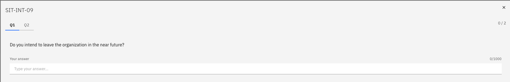

# Complete the Intention Questionnaire

The Intention Questionnaire is a survey distributed to specific employee groups — typically teaching staff — to understand whether employees are considering leaving the organisation. Completing it honestly helps HR have the right conversations at the right time.

1. Open the Questionnaires tab

   From the ESS portal, go to **Employment ▸ Questionnaires** or click the **Questionnaires** tab.

2. Find the Intention Questionnaire

   Locate the questionnaire in the list. It appears with an **Assigned** status and shows the questionnaire ID.

3. Start the questionnaire

   Click on the questionnaire to open it and click **Start**.

4. Answer the questions

   Answer each question honestly. A key question asks whether you intend to leave the organisation — your response (Yes or No) determines whether HR follows up with you. Additional free-text fields allow you to provide context.

   

5. Submit

   Click **Submit** to finalise your response. The questionnaire disappears from your pending list once submitted.
