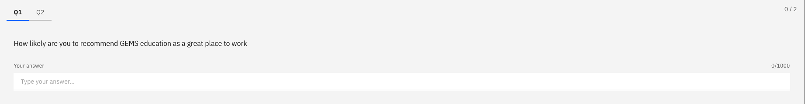

# Complete the NPS questionnaire

The NPS (Net Promoter Score) questionnaire is a brief pulse survey that captures how likely you are to recommend GEMS as a great place to work. It appears periodically in the Questionnaires tab.

1. Open the Questionnaires tab

   From the ESS portal, click the **My work** tab and scroll down to **Questionnaires**.

2. Find the NPS questionnaire

   The NPS questionnaire appears in the list alongside other questionnaires assigned to you.

3. Start the questionnaire

   Click on the NPS questionnaire and click **Start**.

   

4. Provide your rating

   Select your score on the rating scale provided. An optional text field allows you to add a comment explaining your rating.

5. Submit

   Click **Submit** to finalise your response.
