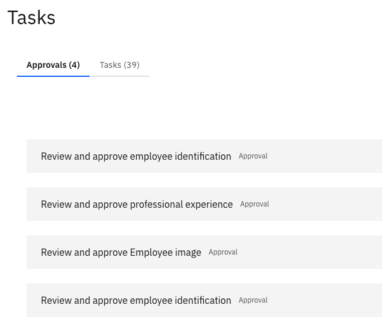

# Use the Approvals and Tasks workspace

The Approvals and Tasks workspace is your central hub for everything that needs your attention — assigned tasks and requests waiting for your approval.

1. Open the workspace

   From the ESS home page, click the **Tasks** tile.

2. Switch between tabs

   The workspace has two tabs:

   | Tab | What you'll find |
   |---|---|
   | **Tasks** | All checklist tasks assigned to you (e.g., onboarding tasks) |
   | **Approvals** | All items waiting for your review and approval (e.g., identification updates, education records, and skill submissions from your direct reports) |

   

3. Open an item

   Click on any item in either tab to open its full detail view and take action.
