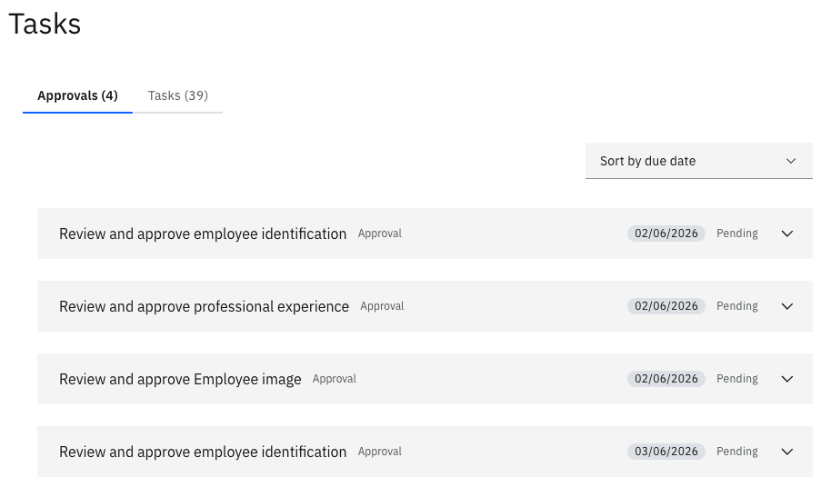

# Review and approve a request

When a team member submits a profile update that requires your approval — such as an identification document, education record, or skill — it appears in your Approvals tab.

1. Open the Approvals tab

   From the ESS portal, navigate to **Tasks ▸ Approvals** tab.

2. Review the list

   All pending approval items are listed, showing the type of request (e.g., Identification, Education, Subject, Professional Experience) and the employee who submitted it.

   

3. Open the request

   Click on a record to open the full detail view and review what the employee submitted.

4. Approve or reject

   Click **Approve** to accept the change, or **Reject** to decline it. The employee is notified of the outcome.
