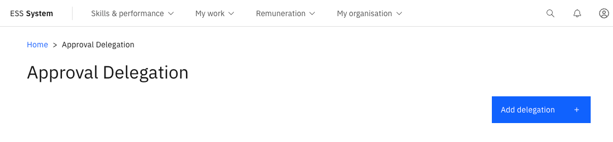

# Set up an approval delegation

Delegations let you hand your approval responsibilities to a colleague while you are away — for example, during annual leave. This ensures requests continue to be processed without interruption.

1. Open Approval delegations

   From the ESS portal, navigate to **Approval delegations**.

2. Add a new delegation

   Click **Add delegation**.

   

3. Select the delegate

   Enter the **name of the delegate** — the person who will act on your behalf while the delegation is active.

4. Set the date range

   Enter a **Start date** and **End date** for the delegation period.

5. Set the scope

   Select the **scope** of the delegation — for example, all approvals or specific workflow types only.

6. Enable and submit

   Check **Enable delegation** to activate it, then click **Submit**.

   The delegation expires automatically at the end date you specified. Offboarding checklist tasks also respect active delegations — if the primary task holder has a delegation in place, the delegated person receives the task automatically.
