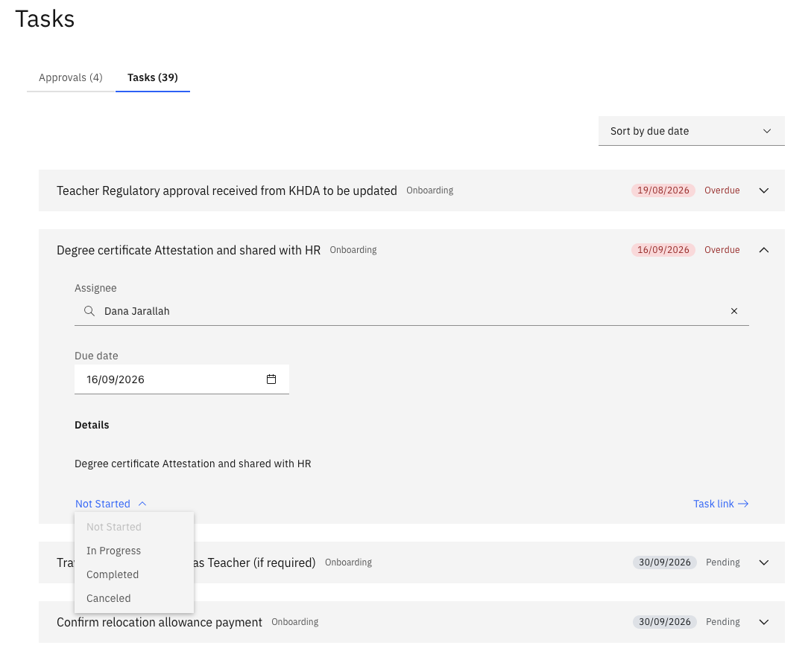

# Complete an onboarding task

When you join GEMS, an onboarding checklist is automatically assigned to you. Each task in the list must be completed as you progress through the onboarding process.

1. Open your task list

   From the ESS portal, navigate to **Tasks**. Your onboarding tasks are listed here with their current status (Open, In Progress, or Completed).

   

2. Open a task

   Click on a task to view its details, including the task description and any dependencies that must be completed before you can progress.

3. Update the status

   Once the task is ready to be completed, update the **status** to reflect that it is done.

4. Confirm

   Click **Confirm** to record the update. The task is marked complete and removed from your active list.
